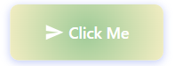
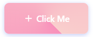

# ✨ GradientButton PCF Component for Power Apps

A Power Apps Component Framework (PCF) control that provides a fully-featured gradient button with 50+ style properties — configurable directly from Power Apps Studio without writing any CSS.

---

## 🎨 Features

- 🌈 **Gradient Background** — Linear, radial, conic, solid; 3-stop color, angle, and position control
- 🔲 **Border & Radius** — Border width, style, color, gradient border, and per-corner radius
- 🌟 **Shadow & Glow** — Drop shadow with offset/blur/spread/inset, plus animated glow effect
- 🔤 **Typography** — Font family, size, weight, style, transform, letter spacing, and text shadow
- 💫 **Animation** — Built-in shimmer, pulse, bounce, and glow animations with configurable duration
- 🖱️ **Interaction** — Ripple on click, hover gradient swap, scale on hover and active
- 🔘 **Icon Support** — 15 built-in SVG icons with 5 position options (left / right / top / bottom / icon-only)
- ⚙️ **States** — Disabled state, loading spinner, tooltip, and fully customizable disabled styling

---

## 📸 Screenshots

### Component Interface

<!-- Add your screenshot here -->

---

## 🚀 Getting Started

### Prerequisites

- Node.js 16+
- Power Platform CLI (`npm install -g pac`)
- .NET 6 SDK
